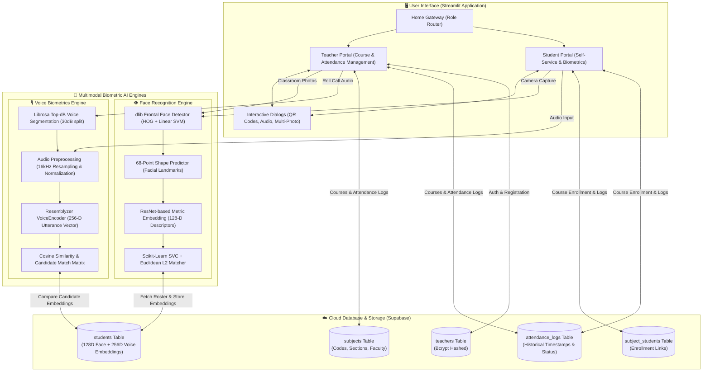
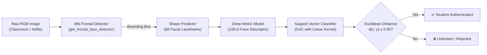
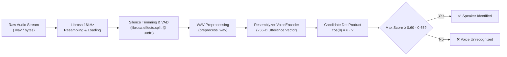
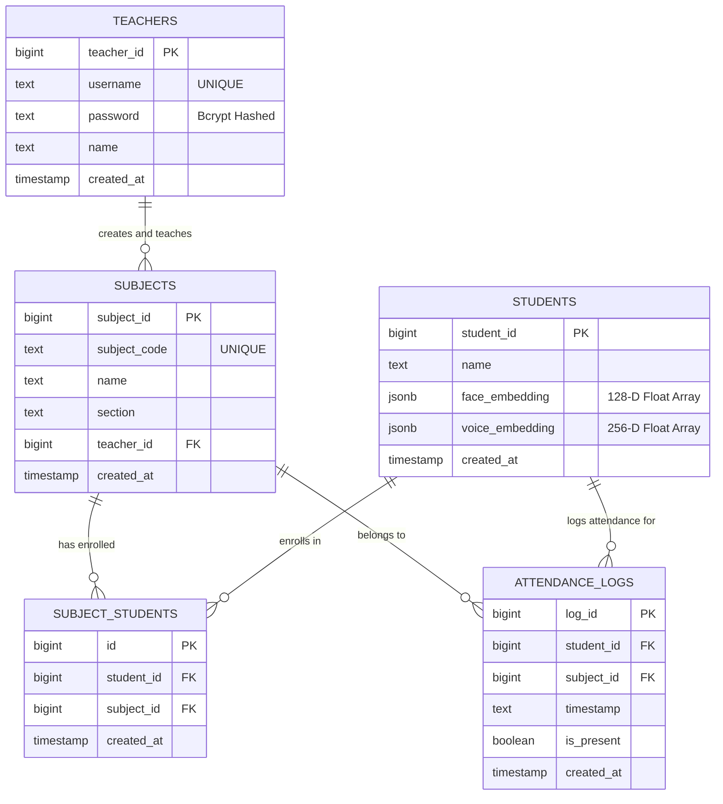
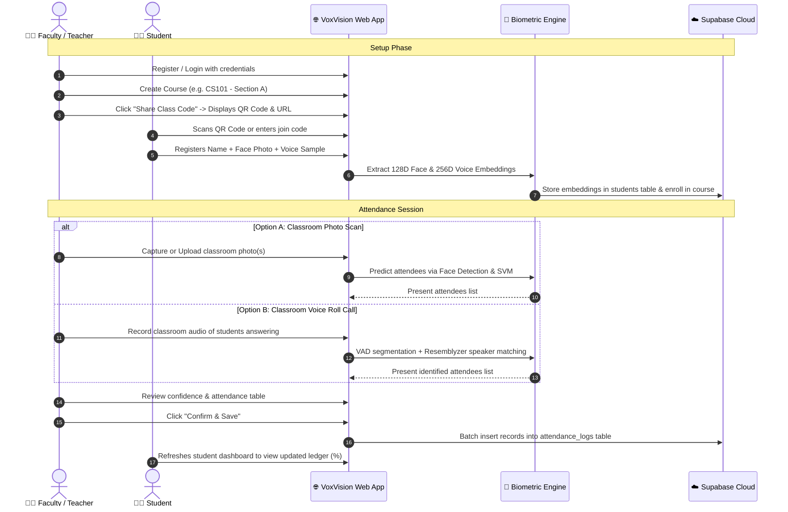

# 🎓 VoxVision | Smart AI-Powered Attendance Platform

<div align="center">

[](https://www.python.org/)
[](https://streamlit.io/)
[](https://supabase.com/)
[](http://dlib.net/)
[](https://github.com/resemble-ai/Resemblyzer)
[](LICENSE)

**Next-generation multimodal biometric attendance platform combining deep facial recognition and acoustic speaker verification for smart classrooms and academic institutions.**

[Key Features](#-key-features) • [System Architecture](#-system-architecture) • [AI Pipelines](#-multimodal-ai-pipelines) • [Database Schema](#-database-schema) • [Installation & Setup](#-installation--setup) • [Code Walkthrough](#-core-code-snippets)

</div>

---

## 📌 Executive Overview

Traditional classroom roll calls and RFID badge systems suffer from proxy attendance, administrative friction, and lost lecture time. **VoxVision** replaces outdated sign-in sheets with a dual-modality biometric verification engine built natively in Python and Streamlit.

With VoxVision, attendance can be registered in two autonomous ways:
1. **🎙️ Voice Biometrics (Acoustic Roll Call)**: Students check in by speaking *"I am present"*. The system extracts 256-dimensional neural voice embeddings to identify enrolled speakers even in ambient classroom noise. Teachers can record continuous audio during roll call to mark the entire roster simultaneously.
2. **📸 Computer Vision (Instant FaceID)**: Students check in via camera selfie, or teachers snap one or multiple wide classroom photos. A deep metric ResNet-based facial pipeline detects, aligns, and extracts 128-dimensional facial descriptors, classifying attendees with a balanced Support Vector Classifier (SVC) and Euclidean distance validation.

---

## ✨ Key Features

### 👨‍🏫 Faculty & Teacher Portal
- **Course Administration**: Create, organize, and manage academic courses with subject codes and section IDs.
- **QR Code & Deep Link Sharing**: Automatically generate high-resolution PNG QR codes (powered by `segno`) and shareable URL join codes (`?join-code=CS101`) for instantaneous student onboarding.
- **Dual Attendance Execution**:
  - **Batch Photo Scan**: Upload or capture classroom photos; automatically detects and identifies multiple students in one frame.
  - **Classroom Voice Roll Call**: Record speech as students respond to roll call; uses voice activity detection (VAD) and sliding chunk segmentation to authenticate present students.
- **Review & Confirm Gatekeeper**: Inspect attendance results in interactive verification tables with individual confidence ratings before committing records to the database.
- **Historical Attendance Analytics**: Real-time aggregated attendance logs grouped by timestamp and course with attendance percentage metrics.

### 👩‍🎓 Student Portal
- **Multimodal Biometric Onboarding**: Simultaneous single-step registration for facial snapshots and voice reference audio (`dlib` 128D + `Resemblyzer` 256D).
- **Fast Biometric Check-In**:
  - Voice verification: Speak phrase *"I am present"* for speaker matching.
  - Camera FaceID: Centered face snapshot matching.
- **One-Click Subject Enrollment**: Join courses manually via subject code or automatically via shared link / QR code scanning.
- **Student Academic Ledger**: Monitor personal attendance records across all enrolled subjects, complete with color-coded progress bars (≥75% green status, <75% warning status) and course unenrollment management.

---

## 🏗️ System Architecture

VoxVision utilizes a modular, decoupled architecture consisting of a **Presentation Layer (Streamlit UI)**, a **Machine Learning Core (Face & Voice Pipelines)**, and a **Persistent Cloud Layer (Supabase PostgreSQL)**.



---

## 🔬 Multimodal AI Pipelines

### 1. Facial Recognition Pipeline (`face_pipeline.py`)

The vision pipeline extracts robust face embeddings that are invariant to lighting variations, head tilts, and facial expressions:



- **Feature Space**: 128-dimensional hypersphere vector where Euclidean distance corresponds directly to facial resemblance.
- **Dynamic Training**: The linear SVC is trained on-the-fly (`train_classifier()`) whenever a student registers, cached via Streamlit's `@st.cache_resource` for low-latency inferences.
- **L2 Verification Filter**: Prevents false positive assignments by checking `np.linalg.norm(student_embedding - encoding) <= 0.60`.

### 2. Acoustic Voice Identification Pipeline (`voice_pipeline.py`)

The voice pipeline extracts unique vocal tract resonances, formant trajectories, and speaker timbres:



- **Voice Activity Detection (VAD)**: Classroom bulk recordings are automatically partitioned into isolated vocal bursts using `librosa.effects.split(audio, top_db=30)`. Chunks under 0.5s are filtered out as ambient noise.
- **Speaker Embedding**: Utterance audio waveforms are processed through an LSTM-based acoustic encoder producing 256-dimensional unit vectors.
- **Cosine Verification**: Similarity is computed as the normalized inner product $\cos(\theta) = \mathbf{u} \cdot \mathbf{v}$. Scores exceeding the threshold mark the student present.

---

## 🗄️ Database Schema

VoxVision is backed by **Supabase PostgreSQL**. Below is the entity relationship diagram representing the relational schema:



### SQL Table Setup (Execute in Supabase SQL Editor)

```sql
-- 1. Create Teachers Table
CREATE TABLE teachers (
    teacher_id BIGINT GENERATED BY DEFAULT AS IDENTITY PRIMARY KEY,
    username TEXT UNIQUE NOT NULL,
    password TEXT NOT NULL,
    name TEXT NOT NULL,
    created_at TIMESTAMP WITH TIME ZONE DEFAULT timezone('utc'::text, now()) NOT NULL
);

-- 2. Create Students Table
CREATE TABLE students (
    student_id BIGINT GENERATED BY DEFAULT AS IDENTITY PRIMARY KEY,
    name TEXT NOT NULL,
    face_embedding JSONB,
    voice_embedding JSONB,
    created_at TIMESTAMP WITH TIME ZONE DEFAULT timezone('utc'::text, now()) NOT NULL
);

-- 3. Create Subjects Table
CREATE TABLE subjects (
    subject_id BIGINT GENERATED BY DEFAULT AS IDENTITY PRIMARY KEY,
    subject_code TEXT UNIQUE NOT NULL,
    name TEXT NOT NULL,
    section TEXT NOT NULL,
    teacher_id BIGINT REFERENCES teachers(teacher_id) ON DELETE CASCADE,
    created_at TIMESTAMP WITH TIME ZONE DEFAULT timezone('utc'::text, now()) NOT NULL
);

-- 4. Create Subject_Students (Enrollments) Junction Table
CREATE TABLE subject_students (
    id BIGINT GENERATED BY DEFAULT AS IDENTITY PRIMARY KEY,
    student_id BIGINT REFERENCES students(student_id) ON DELETE CASCADE,
    subject_id BIGINT REFERENCES subjects(subject_id) ON DELETE CASCADE,
    created_at TIMESTAMP WITH TIME ZONE DEFAULT timezone('utc'::text, now()) NOT NULL,
    UNIQUE(student_id, subject_id)
);

-- 5. Create Attendance Logs Table
CREATE TABLE attendance_logs (
    log_id BIGINT GENERATED BY DEFAULT AS IDENTITY PRIMARY KEY,
    student_id BIGINT REFERENCES students(student_id) ON DELETE CASCADE,
    subject_id BIGINT REFERENCES subjects(subject_id) ON DELETE CASCADE,
    timestamp TEXT NOT NULL,
    is_present BOOLEAN NOT NULL DEFAULT FALSE,
    created_at TIMESTAMP WITH TIME ZONE DEFAULT timezone('utc'::text, now()) NOT NULL
);

-- Recommended Indexing for Fast Querying
CREATE INDEX idx_subject_students_sub ON subject_students(subject_id);
CREATE INDEX idx_subject_students_stu ON subject_students(student_id);
CREATE INDEX idx_attendance_subject ON attendance_logs(subject_id);
CREATE INDEX idx_attendance_student ON attendance_logs(student_id);
```

---

## 💻 Core Code Snippets

### 1. Dual-Model Face Detection & Embedding (`src/pipelines/face_pipeline.py`)
Computes 128-dimensional facial embeddings using `dlib` shape alignment and deep neural metric descriptors:

```python
import dlib
import numpy as np
import face_recognition_models
import streamlit as st

@st.cache_resource
def load_dlib_models():
    detector = dlib.get_frontal_face_detector() 
    sp = dlib.shape_predictor(
        face_recognition_models.pose_predictor_model_location()
    )
    facerec = dlib.face_recognition_model_v1(
        face_recognition_models.face_recognition_model_location()
    )
    return detector, sp, facerec

def get_face_embeddings(image_np):
    detector, sp, facerec = load_dlib_models()
    faces = detector(image_np, 1)
    encodings = []
    for face in faces:
        shape = sp(image_np, face)
        face_descriptor = facerec.compute_face_descriptor(image_np, shape, 1) # 128-D vector
        encodings.append(np.array(face_descriptor))
    return encodings
```

### 2. Bulk Classroom Audio Roll Call Segmentation (`src/pipelines/voice_pipeline.py`)
Processes continuous classroom audio, splits by voice activity detection, and identifies enrolled student voice prints:

```python
from resemblyzer import VoiceEncoder, preprocess_wav
import librosa
import numpy as np
import io

def process_bulk_audio(audio_bytes, candidates_dict, threshold=0.65):
    encoder = VoiceEncoder()
    audio, sr = librosa.load(io.BytesIO(audio_bytes), sr=16000)
    segments = librosa.effects.split(audio, top_db=30)  # Voice Activity Detection
    identified_results = {}

    for start, end in segments:
        if (end - start) < sr * 0.5:  # Filter out bursts < 0.5 sec
            continue
        segment_audio = audio[start:end]
        wav = preprocess_wav(segment_audio)
        embedding = encoder.embed_utterance(wav)

        # Match against class candidate embeddings using cosine inner product
        sid, score = identify_speaker(embedding, candidates_dict, threshold)
        if sid:
            if sid not in identified_results or score > identified_results[sid]:
                identified_results[sid] = score

    return identified_results
```

### 3. Instant QR Code Generation with Deep Linking (`src/components/dialog_share_subject.py`)
Generates dynamic QR codes linked with application query parameters for auto-enrollment:

```python
import streamlit as st
import segno
import io

@st.dialog("Share Class Link")
def share_subject_dialog(subject_name, subject_code):
    app_domain = "snapclass-main.streamlit.app"
    join_url = f"https://{app_domain}/?join-code={subject_code}"

    qr = segno.make(join_url)
    out = io.BytesIO()
    qr.save(out, kind='png', scale=10, border=1)

    col1, col2 = st.columns(2)
    with col1:
        st.markdown('### Copy Link')
        st.code(join_url, language="text")
        st.code(subject_code, language="text")
    with col2:
        st.markdown('### Scan to Join')
        st.image(out.getvalue(), caption='QR Code for Instant Course Joining')
```

---

## 📂 Project Directory Structure

```plaintext
VoxVision/
├── app.py                                # Application entry point & session router
├── requirements.txt                      # Project dependencies & build requirements
├── README.md                             # Comprehensive project documentation
├── .gitignore                            # Git exclusion rules
├── .streamlit/
│   ├── config.toml                       # Streamlit server and theme configurations
│   └── secrets.toml                      # Supabase credentials (URL & API Key)
└── src/
    ├── assets/                           # Application imagery & mascot assets
    │   ├── attendance.jpg
    │   ├── hero_classroom.jpg
    │   ├── student_mascot.jpg
    │   └── teacher_mascot.jpg
    ├── components/                       # Modular UI components & dialog modals
    │   ├── dialog_add_photo.py           # Multi-photo upload/camera dialog
    │   ├── dialog_attendance_results.py  # Review and commit attendance dialog
    │   ├── dialog_auto_enroll.py         # URL join code auto-enrollment dialog
    │   ├── dialog_create_subject.py      # New course creation modal
    │   ├── dialog_enroll.py              # Manual subject code enrollment modal
    │   ├── dialog_share_subject.py       # QR code & invite link sharing dialog
    │   ├── dialog_voice_attendance.py    # Teacher voice roll call dialog
    │   ├── footer.py                     # Responsive footer layouts
    │   ├── header.py                     # Hero banners & navigation headers
    │   └── subject_card.py               # Subject cards with attendance progress bars
    ├── database/                         # Relational data layer & database clients
    │   ├── config.py                     # Supabase client instantiation
    │   └── db.py                         # CRUD queries, bcrypt auth, & session logging
    ├── pipelines/                        # Multimodal machine learning engines
    │   ├── face_pipeline.py              # dlib landmarks, 128D embeddings, & SVM classifier
    │   └── voice_pipeline.py             # Librosa VAD, Resemblyzer embeddings, & cosine matching
    └── ui/
        └── base_layout.py                # Custom CSS design system, typography, & badges
```

---

## 🚀 Installation & Setup

### Prerequisites
- **Python**: Version `3.10` or `3.11` recommended.
- **C++ Compiler & CMake** (Required for compiling `dlib`):
  - **Windows**: Install [Visual Studio Build Tools](https://visualstudio.microsoft.com/visual-cpp-build-tools/) with the *Desktop development with C++* workload, or install pre-compiled wheels via `pip install dlib-bin`.
  - **macOS**: Run `xcode-select --install` and `brew install cmake`.
  - **Linux (Ubuntu/Debian)**: Run `sudo apt-get install build-essential cmake libopenblas-dev liblapack-dev`.
- **Audio Drivers**: A working microphone for voice check-in and webcam for facial recognition.

### 1. Clone the Repository
```bash
git clone https://github.com/hritika2024-15/VoxVision.git
cd VoxVision
```

### 2. Create and Activate a Virtual Environment
```bash
# Windows (PowerShell)
python -m venv venv
.\venv\Scripts\Activate.ps1

# macOS / Linux
python3 -m venv venv
source venv/bin/activate
```

### 3. Install Dependencies
```bash
pip install --upgrade pip setuptools<70.0.0 wheel
pip install -r requirements.txt
```

> **Note on dlib**: If `pip install -r requirements.txt` encounters an issue compiling `dlib` on Windows, install `dlib-bin` directly:
> ```bash
> pip install dlib-bin
> ```

### 4. Configure Supabase Credentials
Create a `.streamlit/secrets.toml` file in the project root:

```toml
SUPABASE_URL = "https://your-project-id.supabase.co"
SUPABASE_KEY = "your-anon-or-service-role-key"
```

### 5. Initialize the Database
Open the **SQL Editor** in your Supabase dashboard and execute the SQL script provided in the [Database Schema](#-database-schema) section.

### 6. Run the Application
```bash
streamlit run app.py
```
Open your browser and navigate to `http://localhost:8501`.

---

## 📱 User Workflow Guide



---

## 🛡️ Security & Privacy Considerations

- **No Raw Password Storage**: Teacher authentication uses one-way cryptographic salting and hashing via `bcrypt`.
- **Biometric Vector Abstraction**: Facial images and voice recordings are converted into mathematical embedding vectors (128-D and 256-D floats). Raw biometric source images and audio files are not permanently stored in the database, protecting student privacy.
- **Relational Integrity**: Foreign key constraints with cascading deletes ensure that when a course or student is removed, orphaned attendance logs and enrollments are cleanly removed.

---

## 🔮 Roadmap & Future Enhancements

- [ ] **Live RTSP Camera Stream Ingestion**: Direct integration with IP CCTV classroom cameras for continuous, non-intrusive roll call.
- [ ] **Liveness & Anti-Spoofing Detection**: Eye-blink detection and head pose tracking to prevent photo presentation attacks.
- [ ] **Automated PDF / Excel Ledger Exports**: Generate downloadable university-accredited attendance transcripts.
- [ ] **Parent & Admin SMS/Email Alerts**: Automated notifications when student attendance drops below the 75% threshold.
- [ ] **Multi-Language Voice Support**: Fine-tuned acoustic models for multi-accented speech and varied roll call phrases.


## 👥 Authors & Acknowledgments

- **Hritika Prasad** ([@hritika2024-15](https://github.com/hritika2024-15)) - *Architecture, Core Pipelines & Full Stack Development*
- Models & open-source libraries:
  - [Davis King's dlib](http://dlib.net/) & [Adam Geitgey's face_recognition_models](https://github.com/ageitgey/face_recognition_models)
  - [Resemblyzer (Resemble AI)](https://github.com/resemble-ai/Resemblyzer) for speaker verification embeddings
  - [Streamlit](https://streamlit.io/) for the reactive web application framework
  - [Supabase](https://supabase.com/) for cloud PostgreSQL database hosting

<div align="center">
<b>⭐ Star this repository if you find VoxVision helpful for smart education and biometric attendance! ⭐</b>
</div>
